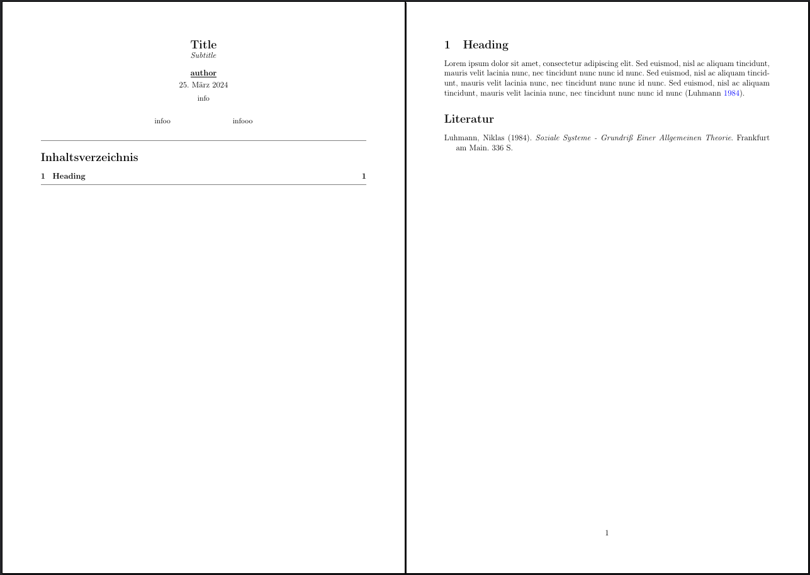

# Latex_Template

 This is the Latex Template I write most of my Seminar Assignments with.

---

## make alias for copy_latex_templates.sh

1. make script executable

```bash
chmod +x ~/PATH/copy_latex_templates.sh
```

2. open bashrc

```bash
nano ~/.bashrc
```

3. add the alias to the .bashrc

```bash
alias create_latex='~/PATH/copy_latex_templates.sh'
```

4. reload .bashrc to apply changes

```bash
source ~/.bashrc
```

✨ now create latex template folders easily ✨
